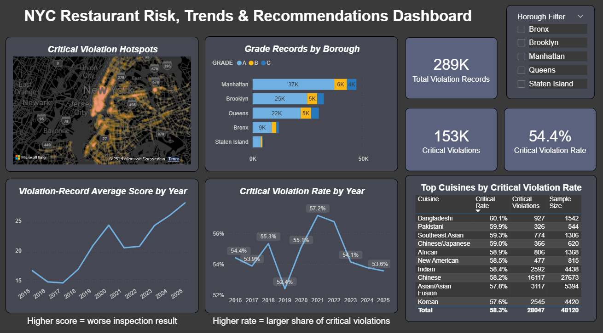

# NYC Restaurant Health Inspection Analysis

## Project Overview

This project analyzes NYC restaurant health inspection data using MySQL and Power BI.

The goal is to clean raw inspection records, handle violation-record level data carefully, and build a dashboard that helps identify restaurant inspection risk patterns by borough, neighborhood, cuisine type, and time.

A key data issue is that the original dataset is at the violation-record level, meaning one restaurant inspection can appear multiple times if it has multiple violations. To avoid misleading inspection counts, I created separate inspection-level and violation-level logic for analysis.


This project demonstrates:

- SQL data cleaning and validation
- Inspection-level and violation-level analysis
- Power BI dashboard design
- Risk pattern analysis by geography, cuisine, and time
- Decision-support recommendations based on inspection trends

---

## Dataset

The dataset comes from NYC Open Data:

[NYC Open Data - DOHMH New York City Restaurant Inspection Results](https://data.cityofnewyork.us/Health/DOHMH-New-York-City-Restaurant-Inspection-Results/43nn-pn8j)

The original raw dataset is not included in this repository because the file size is too large for GitHub upload.

More dataset information is included here:

```text
data/data_source.txt
```

The data dictionary is included in the `data/` folder.

This analysis uses inspection records from 2015 to 2025 after removing invalid placeholder dates such as `01/01/1900`.

One important point is that the original dataset is at the violation-record level. This means one restaurant inspection can have multiple violation records.

---

## Business Questions

This project answers the following questions:

### 1. Data Preparation

- Handle missing values
- Standardize cuisine names
- Clean inspection and grade date fields

### 2. Overall Insights

- Count total inspections by borough
- Check grade distribution across NYC
- Find the most common inspection types

### 3. Violation Analysis

- Find the top 10 most frequent violations
- Compare critical and non-critical violations
- Identify boroughs or neighborhoods with higher critical violation rates

### 4. Cuisine Analysis

- Compare grades by cuisine type
- Find cuisines with the lowest average scores
- Identify cuisines with the highest proportion of critical violations

### 5. Geographic and Time Trends

- Visualize grade records across boroughs
- Check whether scores or critical violation rates changed over time
- Highlight neighborhoods with higher critical violation rates

### 6. Recommendations

- Suggest where targeted inspections or public health campaigns should focus
- Identify cuisines and areas where food safety training may help
- Highlight possible policy focus areas

---

## Tools Used

- MySQL
- MySQL Workbench
- Power BI
- Excel
- GitHub

---

## Project Structure

```text
NYC-Restaurant-Health-Inspection-Analysis/
│
├── data/
│   ├── data_source.txt
│   └── RestaurantInspectionDataDictionary.xlsx
│
├── images/
│   └── dashboard_screenshot.png
│
├── powerbi/
│   └── NYC_Restaurant_Inspection_Dashboard.pbix
│
├── sql/
│   ├── 01_nyc_restaurant_data_cleaning.sql
│   └── 02_nyc_restaurant_exploratory_analysis.sql
│
└── README.md
```

---

## Data Cleaning

The cleaning process was kept simple and focused on the fields needed for analysis.

Main cleaning steps:

- Converted blank text values into `NULL`
- Filled missing borough, neighborhood, cuisine, grade, action, and critical flag values
- Standardized selected cuisine names without over-cleaning the original categories
- Replaced invalid placeholder dates such as `01/01/1900` with `NULL`
- Checked cleaned cuisine, grade, date range, critical flag, and action values

Cleaning script:

```text
sql/01_nyc_restaurant_data_cleaning.sql
```

---

## SQL Analysis

The SQL analysis covers three main areas.

### Overall Insights

- Inspections by borough
- Grade distribution
- Most common inspection types

### Violation Analysis

- Top 10 most frequent violations
- Critical vs non-critical violations
- Boroughs or neighborhoods with higher critical violation rates

### Cuisine Analysis

- Grades by cuisine type
- Cuisines with the lowest average scores
- Cuisines with higher critical violation rates

Analysis script:

```text
sql/02_nyc_restaurant_exploratory_analysis.sql
```

---

## Power BI Dashboard

The Power BI dashboard focuses on restaurant inspection risk, geographic patterns, time trends, and recommendation support.

The dashboard includes:

- Critical violation density map
- Grade distribution by borough
- Overall critical violation rate
- Average violation-record score trend by year
- Critical violation rate trend by year
- Top neighborhoods by critical violation rate
- Top cuisines by critical violation rate
- Borough filter for interactive analysis

The dashboard helps identify where critical violations are geographically concentrated, which boroughs and cuisines show higher risk patterns, and whether inspection scores or critical violation rates have improved or worsened over time.



---

## Key Findings

- Critical violations accounted for a meaningful share of valid violation records, making them an important risk indicator for analysis.
- Some neighborhoods showed higher critical violation rates than others, suggesting areas that may need closer monitoring.
- Certain cuisine groups showed higher critical violation rates, which may indicate where targeted food safety training or review could be useful.
- Average violation-record scores increased in later years. Since higher scores represent worse inspection results, this may suggest worsening inspection outcomes, although changes in inspection patterns should also be considered.
- Critical violation rates changed year by year and did not show a clear stable improvement pattern.
- Because the raw data is at the violation-record level, inspection-level logic was needed to avoid double-counting and make risk comparisons more reliable.

In NYC restaurant inspections, a higher score means a worse result because scores represent violation points.

---

## Decision Support / Recommendations

Based on the analysis, the dashboard could help public health or inspection teams:

1.Prioritize neighborhoods with higher critical violation rates for further review.
2.Identify cuisine groups that may benefit from targeted food safety training.
3.Monitor score trends and critical violation rates over time.
4.Compare borough and neighborhood-level risk patterns more clearly.
5.Review areas or cuisine groups that repeatedly show higher-risk inspection patterns.

The purpose of the dashboard is not to make final policy decisions, but to make inspection risk patterns easier to identify, compare, and prioritize.

---

## Notes

This project is meant to show basic junior data analyst skills, including SQL cleaning, exploratory analysis, Power BI dashboard building, and turning analysis results into simple recommendations.

Some dashboard visuals use violation-record level data, so the labels are written carefully to avoid treating every row as a separate inspection.
