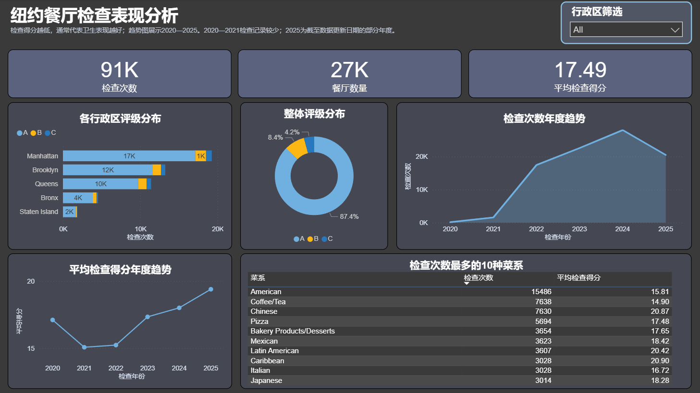
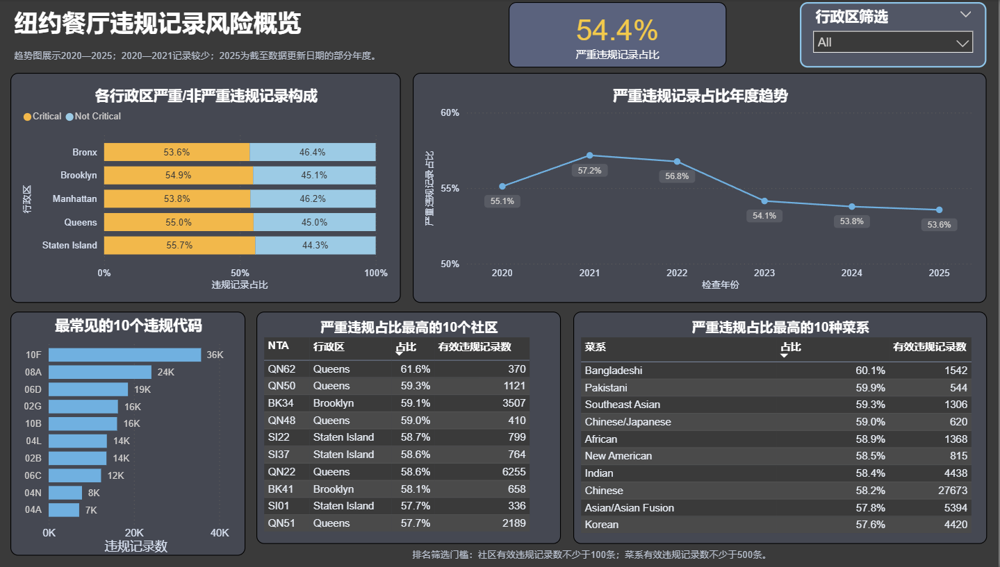

# 纽约餐厅卫生检查分析

## 1. 项目简介

本项目使用 NYC Open Data 的餐厅卫生检查数据，通过 MySQL 清洗和整理不同分析粒度，并在 Power BI 中展示检查表现、评分分布和违规风险。重点是避免把一条违规记录误当成一次独立检查。

## 2. 分析目标

- 统计检查次数、餐厅数量、评分和年度变化。
- 比较行政区、菜系和社区之间的检查表现。
- 分析严重与非严重违规记录的构成、常见违规代码及高占比群体。
- 明确区分检查粒度与违规记录粒度，避免重复计数。

## 3. 数据来源与数据范围

数据来自 [NYC Open Data：DOHMH New York City Restaurant Inspection Results](https://data.cityofnewyork.us/Health/DOHMH-New-York-City-Restaurant-Inspection-Results/43nn-pn8j)。原始数据一行代表一条 **violation record**；同一次检查若发现多项违规，会出现多行。

清洗后的分析范围为 2015—2025 年。Dashboard 的年度趋势主要展示 2020—2025 年；2015-2020年记录为个例，而 2020—2021 年记录也较少，2025 年仅统计到数据更新日期，是部分年度，不能与完整年度直接等量比较。仓库中的 `data_sample/` 是展示字段结构的样例，不等同于完整数据。

更详细的来源说明见 [docs/data_source.txt](docs/data_source.txt)，字段字典见 [docs/RestaurantInspectionDataDictionary.xlsx](docs/RestaurantInspectionDataDictionary.xlsx)。

## 4. 使用工具

- MySQL / MySQL Workbench：清洗、校验和建立分析 View。
- Power BI：连接本地 MySQL 数据库、建立模型并制作两页 Dashboard。
- Excel：查看原始字段字典。

## 5. 数据处理过程

1. 处理空字符串、缺失值和 `01/01/1900` 等无效占位日期。
2. 清理日期字段，并处理菜系字段的两端空格和空值，同时检查行政区、评分、等级和违规标记。
3. 保留 violation-record 数据用于违规代码和严重违规分析。
4. 单独整理 inspection 粒度 View，用于 Grade、Score 和检查次数分析。inspection-level 使用 CAMIS、检查日期和检查类型近似识别一次检查；3 个 Score 或 Action 不一致的组合未纳入 inspection-level 分析。该组合不是官方 inspection ID，也不应视为完全可靠的唯一键。
5. 将两个粒度的数据分别接入 Power BI。实际数据源为本地 MySQL 数据库 `nyc_restaurant_inspection` 中的 inspection-level View 和 violation-record View。

相关 SQL：

- [数据清洗](sql/01_nyc_restaurant_data_cleaning.sql)
- [探索性分析](sql/02_nyc_restaurant_exploratory_analysis.sql)
- [指标与 View](sql/03_nyc_restaurant_analysis.sql)

## 6. 主要指标口径

| 指标 | 数据粒度与定义 |
|---|---|
| 检查次数 | inspection-level 数据中的记录数，同一次检查不重复计算 |
| 餐厅数量 | inspection-level 数据中的去重餐厅编号数 |
| Grade | 来自 inspection-level 数据的检查等级 |
| 平均检查得分 | inspection-level 的 Score 平均值；Score 越低通常代表检查结果越好 |
| 有效违规记录 | violation-record 中违规代码非空的记录 |
| 严重违规占比 |严重违规记录数 / 严重或非严重标记有效的违规记录数 |
| 违规代码频次 | violation-record 中各违规代码的记录数 |

## 7. 分析内容

- 检查次数、餐厅数量、平均得分和 Grade 分布。
- 行政区 Grade 构成、年度检查次数和平均得分趋势。
- 常见违规代码、行政区严重违规构成。
- 严重违规占比较高的社区和菜系。最低有效记录数门槛在 Power BI 视觉筛选中应用：社区不少于 100 条，菜系不少于 500 条。

## 8. 主要发现

- Dashboard 中约有 91K 次检查、27K 家餐厅，整体平均检查得分为 17.49。
- A 级记录占有效 Grade 的大多数；不同地区的等级构成仍有差异。
- 2025 年平均检查得分高于前几年，但该年是部分年度，只能作为阶段性结果观察。
- 有效违规记录中严重违规占比为 54.4%；违规代码 `10F` 的记录数最高。
- 社区和菜系排名设置了有效记录数下限，减少小样本比例对排名的影响。

## 9. Dashboard 展示





## 10. 项目文件结构

```text
01_NYC_Restaurant_Inspection/
├─ README.md
├─ data_sample/   # 数据样例，不是完整原始数据
├─ docs/          # 数据来源和字段字典
├─ images/        # 最终 Dashboard 截图
├─ powerbi/       # PBIP 项目文件
└─ sql/           # 清洗、分析和 View SQL
```

## 11. 如何查看或复现

直接查看上方截图即可了解结果。若需复现，先从 NYC Open Data 下载完整数据并导入 MySQL，依次运行 `sql/` 中的脚本，再打开 [Power BI 项目](powerbi/NYC_Restaurant_Inspection_Dashboard.pbi.pbip)。其他电脑需要重新配置 MySQL 连接和凭据。

## 12. 数据限制

- 原始表是违规记录粒度，直接计数会重复计算检查次数。
- 2020—2021 年记录较少，2025 年是截至更新日期的部分年度。
- Score 和严重违规占比是描述性指标，不能单独解释造成差异的原因。
- 仓库样例不能替代完整数据，也不保证在其他设备上直接刷新 Power BI。
